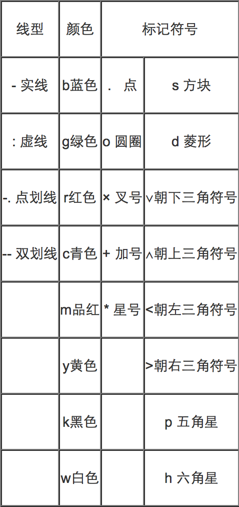

#Matlab Graph

[参考博客](http://blog.csdn.net/wangcj625/article/details/6287735)    
强大的绘图功能是Matlab的特点之一，Matlab提供了一系列的绘图函数，用户不需要过多的考虑绘图的细节，只需要给出一些基本参数就能得到所需图形，这类函数称为**高层绘图函数**。     

此外，Matlab还提供了直接对图形句柄进行操作的低层绘图操作。    
这类操作将图形的每个图形元素（如坐标轴、曲线、文字等）看做一个独立的对象，系统给每个对象分配一个句柄，可以通过句柄对该图形元素进行操作，而不影响其他部分。

##二维绘图
二维图形是将平面坐标上的数据点连接起来的平面图形。可以采用不同的坐标系，如直角坐标、对数坐标、极坐标等。     
二维图形的绘制是其他绘图操作的基础。    

###plot
在Matlab中，最基本而且应用最为广泛的绘图函数为plot，利用它可以在二维平面上绘制出不同的曲线。

plot函数用于绘制二维平面上的线性坐标曲线图，要提供一组x坐标和对应的y坐标，可以绘制分别以x和y为横、纵坐标的二维曲线。 
   
plot函数的应用格式    `plot(x,y)`   
 其中x,y为长度相同的向量，存储x坐标和y坐标。
 	
 	x=0:pi/100:2*pi;
	y=2*exp(-0.5*x).*sin(2*pi*x);
	plot(x,y)
	
注意：指数函数和正弦函数之间要用点乘运算，因为二者是向量。

----
这是以参数形式给出的曲线方程，只要给定参数向量，再分别求出x,y向量即可输出曲线：

	t=-pi:pi/100:pi;
	x=t.*cos(3*t);
	y=t.*sin(t).*sin(t);
	plot(x,y)

以上提到plot函数的**自变量x,y为长度相同的向量**，这是最常见、最基本的用法。    
实际应用中还有一些变化。分别说明：

1. 多个输入参数     
	plot函数可以包含若干组向量对，每一组可以绘制出一条曲线。     
	含多个输入参数的plot函数调用格式为：
	`plot(x1，y1，x2，y2，…，xn，yn)`    
	
		x=linspace(0,2*pi,100);
		plot(x,sin(x),x,2*sin(x),x,3*sin(x))
		
2. 矩阵参数     
	当输入参数有矩阵形式时，配对的x,y按对应的列元素为横坐标和纵坐标绘制曲线，曲线条数等于矩阵的列数。

		x=linspace(0,2*pi,100);
		y1=sin(x);
		y2=2*sin(x);
		y3=3*sin(x);
		x=[x;x;x]';
		y=[y1;y2;y3]';
		plot(x,y,x,cos(x))

	x,y都是含有三列的矩阵，它们组成输入参数对，绘制三条曲线；x和cos(x)又组成一对，绘制一条余弦曲线。
	
	利用plot函数可以直接将矩阵的数据绘制在图形窗体中，此时plot函数将矩阵的每一列数据作为一条曲线绘制在窗体中。
		
		A=pascal(5)
		plot(A)
	
3. 绘图选项

	
	
		x=(0:pi/100:2*pi)';
		y1=2*exp(-0.5*x)*[1,-1];
		y2=2*exp(-0.5*x).*sin(2*pi*x);
		x1=(0:12)/2;
		y3=2*exp(-0.5*x1).*sin(2*pi*x1);
		plot(x,y1,'k:',x,y2,'b--',x1,y3,'rp');
4. 双纵坐标函数plotyy

###绘制图形的辅助操作

1. 图形标注
	
		title('Graph Name')
		xlabel('x')
		ylabel('y')
		text(1,2,'A')
		legend('line 1', 'line 2', 'line 3')
2. 坐标刻度

	在绘制图形时，Matlab可以自动根据要绘制曲线数据的范围选择合适的坐标刻度，使得曲线能够尽可能清晰的显示出来。     
所以，一般情况下用户不必选择坐标轴的刻度范围。    
但是，如果用户对坐标不满意，可以利用axis函数对其重新设定。    
其调用格式为
	
	`axis([xmin xmax ymin ymax zmin zmax])`   
3. 图形保持

	一般情况下，每执行一次绘图命令，就刷新一次当前图形窗口，图形窗口原有图形将不复存在。   
如果希望在已经存在的图形上再继续添加新的图形，可以使用图形保持命令hold。    
hold on/off 命令是保持原有图形还是刷新原有图形，不带参数的hold命令在两者之间进行切换。

##三维绘图

